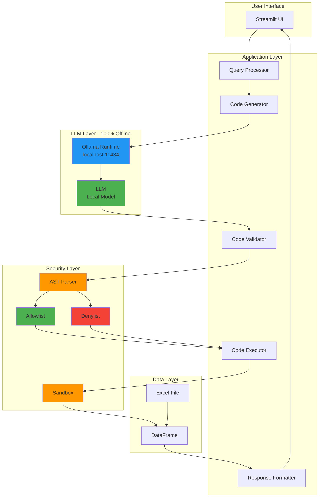
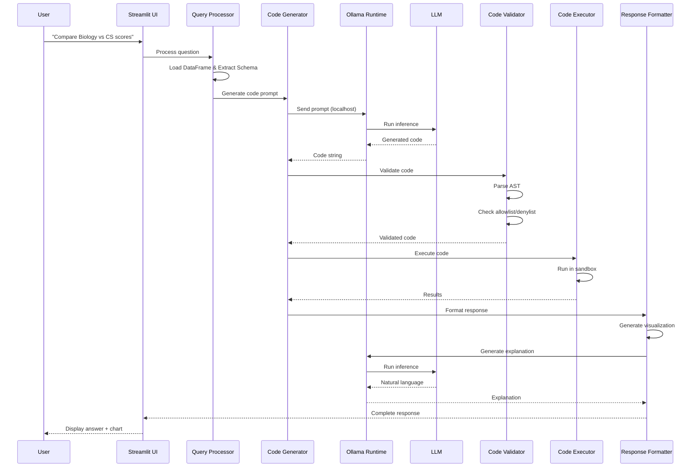
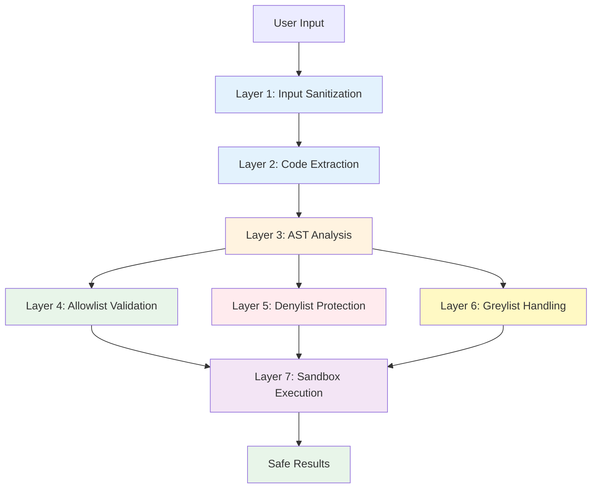
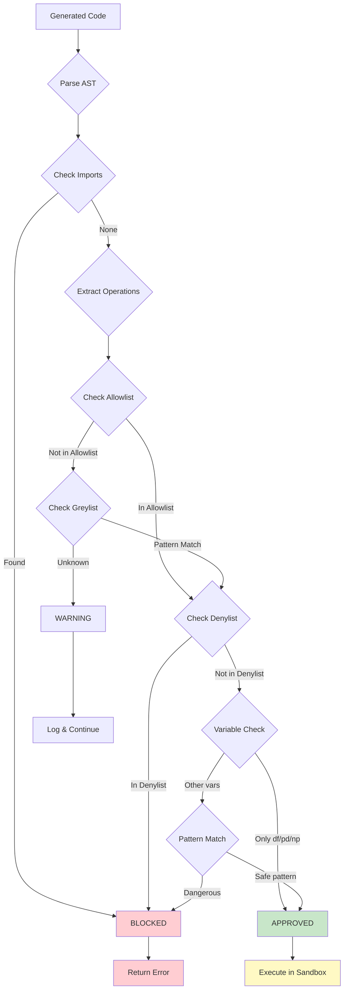
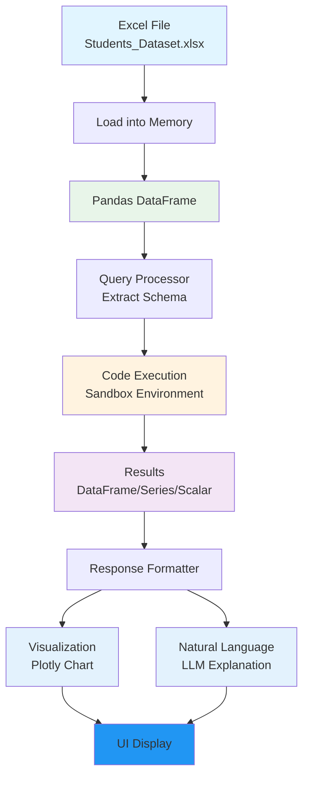

# Pharmacy Data Chatbot

A secure, chatbot for querying pharmacy data using natural language. 

**Academic Project - Lebanese University**

## Overview

This application enables users to analyze pharmacy data through natural language queries. The system dynamically generates pandas code using a local LLM, validates it through multi-layer security, executes it in a sandboxed environment, and returns formatted insights with interactive visualizations.

### Key Features

- **Natural Language Queries** - Ask questions in plain English
- **Dynamic Code Generation** - LLM generates pandas code on-the-fly
- **Multi-Layer Security** - AST-based validation, allowlist/denylist enforcement, sandboxed execution
- **Interactive Visualizations** - Automatic chart generation with Plotly
- **Modern UI** - Streamlit-based interface with dark theme
- **Zero API Costs** - Complete privacy, no external services

## Project Structure

```
project_chatbot/
├── src/                        # Source code
│   ├── __init__.py
│   ├── app.py                  # Streamlit main application
│   ├── config.py               # Configuration management
│   ├── logger.py               # Logging system
│   ├── exceptions.py           # Custom exceptions
│   ├── utils.py                # Utility functions
│   ├── query_processor.py      # Query processing pipeline
│   ├── code_generator.py       # LLM code generation
│   ├── code_validator.py       # Security validation
│   ├── code_executor.py        # Sandboxed execution
│   └── response_formatter.py   # Response formatting & visualization
├── tests/                      # Test suite
│   ├── __init__.py
│   ├── test_validator.py
│   ├── test_executor.py
│   └── test_integration.py
├── data/                       # Data files
│   └── Students_Dataset.xlsx
├── env/                        # Virtual environment (not in git)
├── run.py                      # Application entry point
├── requirements.txt            # Python dependencies
├── README.md
└── .gitignore
```

## System Architecture

### High-Level Architecture



### Complete Request Flow



### Component Architecture

#### 1. Query Processor (`query_processor.py`)
- Orchestrates the complete pipeline
- Loads and manages DataFrame
- Builds schema context for LLM
- Generates prompts with examples
- Coordinates all components

#### 2. Code Generator (`code_generator.py`)
- Interfaces with Ollama runtime
- Sends prompts to LLM
- Extracts code from LLM responses
- Handles retries and error recovery
- Manages model connection

#### 3. Code Validator (`code_validator.py`)
- Parses code to Abstract Syntax Tree (AST)
- Extracts operations, imports, variables
- Validates against allowlist (approved operations)
- Blocks dangerous operations via denylist
- Handles greylist (unknown operations)
- Pattern-based validation

#### 4. Code Executor (`code_executor.py`)
- Creates sandboxed execution environment
- Restricted globals (only df, pd, np)
- No `__builtins__` access
- Timeout protection (10 seconds)
- Memory limits
- Safe error handling

#### 5. Response Formatter (`response_formatter.py`)
- Formats execution results
- Generates Plotly visualizations
- Creates natural language explanations
- Detects appropriate chart types
- Handles different data types

#### 6. Streamlit UI (`app.py`)
- Modern chat interface
- Message history management
- Interactive visualizations
- Code display (expandable)
- System status monitoring

## Security Architecture

### Multi-Layer Defense



### Security Layers

1. **Input Sanitization**
   - Validates input length (max 1000 chars)
   - Checks for dangerous patterns
   - Sanitizes special characters

2. **Code Extraction**
   - Extracts code from markdown blocks
   - Removes comments and explanations
   - Cleans formatting

3. **AST Analysis**
   - Parses code to Abstract Syntax Tree
   - Extracts all operations, imports, variables
   - Deep analysis before execution

4. **Allowlist Validation** (Default-Deny)
   - Only approved operations allowed
   - Categories: groupby, mean, sum, filter, merge, corr, etc.
   - Prevents zero-day exploits

5. **Denylist Protection** (Defense-in-Depth)
   - Blocks dangerous operations
   - Examples: eval, exec, import, open, os, sys, subprocess
   - Catches known threats

6. **Greylist Handling**
   - Unknown operations require verification
   - Pattern-based approval
   - Audit logging

7. **Sandbox Execution**
   - Restricted globals (only df, pd, np)
   - No `__builtins__` access
   - Timeout protection (10 seconds)
   - Memory limits
   - Exception isolation

### Security Validation Flow



## Technology Stack

| Component | Technology | Purpose | Offline Status |
|-----------|-----------|---------|----------------|
| UI Framework | Streamlit | Web interface | ✅ 100% Local |
| Data Processing | Pandas | Data manipulation | ✅ 100% Local |
| LLM Runtime | Ollama | Local LLM server | ✅ 100% Local |
| LLM Model | gpt-oss:120b-cloud | Code generation | ✅ 100% Local |
| Excel Reader | openpyxl | Read Excel files | ✅ 100% Local |
| Visualization | Plotly | Interactive charts | ✅ 100% Local |
| Code Analysis | AST (built-in) | Security validation | ✅ 100% Local |

## Data Flow



## Requirements

### Hardware

- CPU: 4+ cores (8+ recommended)
- RAM: 16GB minimum (32GB recommended)
- Storage: 20GB free space
- GPU: Optional but recommended (NVIDIA with 8GB+ VRAM)

### Software

- Python 3.9+
- Ollama

## Installation

### 1. Install Ollama

Download and install Ollama from [ollama.ai](https://ollama.ai/).

**Windows**: Add Ollama to PATH if not automatically added:
```powershell
# If Ollama is at: C:\Users\<username>\AppData\Local\Programs\Ollama\ollama.exe
$env:Path += ";C:\Users\<username>\AppData\Local\Programs\Ollama"
```

### 2. Pull the Model
Online:
```bash
ollama pull gpt-oss:120b-cloud
```
Offline:
```bash
ollama pull deepseek-coder:6.7b
```


### 3. Set Up Python Environment

```bash
# Create virtual environment
python -m venv env

# Activate environment
# Windows:
env\Scripts\activate
# macOS/Linux:
source env/bin/activate

# Install dependencies
pip install -r requirements.txt
```

### 4. Verify Data File

Ensure file is in the `data/` directory.

## Usage

### Start Ollama

```bash
ollama serve
```

### Run the Application

```bash
streamlit run run.py
```

The application will open in your default browser at `http://localhost:8501`.

## Configuration

Edit `src/config.py` to customize:

- **LLM Settings** - temperature, timeout
- **Security Settings** - Allowed/blocked operations, execution limits
- **UI Settings** - Page title, theme, chart settings

Edit `src/.env` to customize:
- **OLLAMA_MODEL** - if online gpt-oss:120b-cloud, if offline deepseek-coder:6.7b
- **OLLAMA_HOST** - if online https://ollama.com, if offline http://localhost:11434

## Troubleshooting

### Ollama Connection Failed

1. Ensure Ollama is running: `ollama serve`
2. Check if the model is installed: `ollama list`
3. Pull the model if missing: `ollama pull gpt-oss:120b-cloud` or `ollama pull deepseek-coder:6.7b`
4. Verify Ollama is in PATH (Windows)


### Slow Response Times

- Use a GPU for faster inference
- Consider model quantization
- Reduce query complexity

### Memory Issues

- Ensure 16GB+ RAM available
- Close other applications
- Consider using a smaller model

## Offline Operation

- **Ollama**: Runs locally on localhost:11434
- **DeepSeek Coder**: Model loaded in memory
- **All Processing**: Local machine only
- **No Internet**: Required only for initial setup
- **No API Calls**: Zero external dependencies

## Error Handling

1. **Code Generation Fails**
   - Retry with simpler prompt
   - Return user-friendly error

2. **Validation Fails**
   - Show security violation message
   - Suggest rephrasing question

3. **Execution Fails**
   - Capture error safely
   - Return helpful message
   - Log for debugging

4. **Timeout**
   - Stop execution after 10 seconds
   - Suggest simpler query


